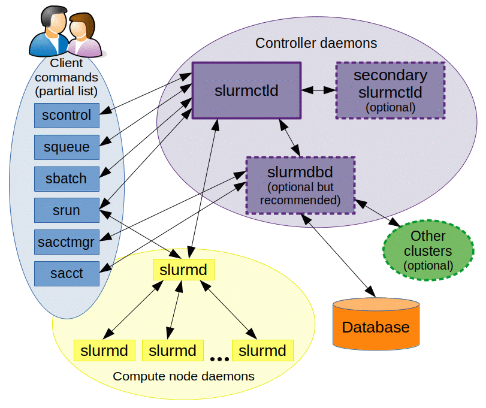

- Slurm as a workload manager (+practical session: how to use Slurm)

## Intro
Slurm is an open source, fault-tolerant, and highly scalable cluster management and job scheduling system for large and small Linux clusters. Slurm requires no kernel modifications for its operation and is relatively self-contained. As a cluster workload manager, Slurm has three key functions. First, it allocates exclusive and/or non-exclusive access to resources (compute nodes) to users for some duration of time so they can perform work. Second, it provides a framework for starting, executing, and monitoring work (normally a parallel job) on the set of allocated nodes. Finally, it arbitrates contention for resources by managing a queue of pending work. 

## Architecture 
Slurm is a system used to manage and organize work on a cluster — a group of computers working together to perform complex tasks.

At the core of Slurm is a central manager, called slurmctld, which keeps track of available resources (like CPUs and memory) and assigns jobs to the appropriate computers. There can also be a backup manager that takes over if the main one fails.

Each computer in the cluster (called a node) runs a program called slurmd. This acts like a remote assistant: it waits for tasks, runs them, sends back results, and then waits for more.

To keep a record of all activity, an optional component called slurmdbd can be used. It stores accounting information — such as who used what resources and when — in a shared database.

Another optional component, slurmrestd, allows users and applications to communicate with Slurm over the web using a REST API.

Users can interact with Slurm using several simple commands:

* srun: starts a job,

* scancel: cancels a running or queued job,

* sinfo: shows the current status of the system,

* squeue: displays information about jobs currently running or waiting,

* sacct: provides detailed reports on finished jobs.

There’s also a graphical interface called sview that visually shows system and job status, including how the nodes are connected.

Administrators can use tools like:

* scontrol: to monitor or modify how the system is working,

* sacctmgr: to manage users, projects, and resource allocations.

Finally, for developers, Slurm also offers APIs that allow software to interact with the system automatically.

## Commands
Man pages exist for all Slurm daemons, commands, and API functions. The command option --help also provides a brief summary of options. Note that the command options are all case sensitive.

To have a look to more general commands
[SLURM Quick Start Summary (PDF)](https://slurm.schedmd.com/pdfs/summary.pdf)

## MPI
MPI use depends upon the type of MPI being used. There are three fundamentally different modes of operation used by these various MPI implementations.

Slurm directly launches the tasks and performs initialization of communications through the PMI2 or PMIx APIs. (Supported by most modern MPI implementations.)
Slurm creates a resource allocation for the job and then mpirun launches tasks using Slurm's infrastructure (older versions of OpenMPI).
Slurm creates a resource allocation for the job and then mpirun launches tasks using some mechanism other than Slurm, such as SSH or RSH. These tasks are initiated outside of Slurm's monitoring or control. Slurm's epilog should be configured to purge these tasks when the job's allocation is relinquished. The use of pam_slurm_adopt is also strongly recommended.


